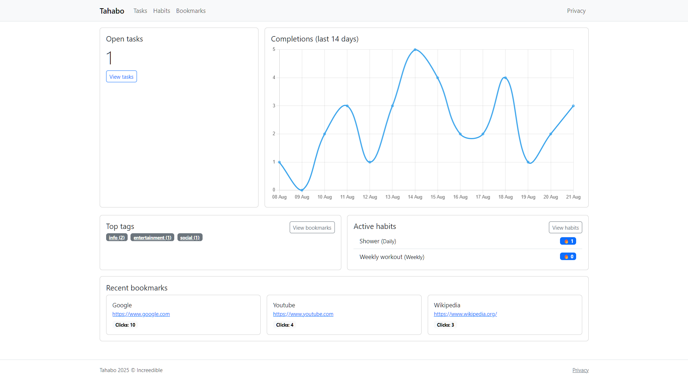

# Tahabo

The app provides a clean interface and basic functionality for managing Tasks, Habits, and Bookmarks, all with full CRUD operations.
This is a demo application built to get familiar with ASP.NET Core MVC.



## Features

* Tasks: create, edit, filter, mark done, and track completions
* Habits: create, edit, check-in with streak tracking
* Bookmarks: save websites, mark favorites, tag and filter
* Dashboard: overview of open tasks, recent bookmarks, active habits, top tags, and task completion trends
* Responsive UI with Bootstrap styling
* Toast-style feedback messages for user actions

## Tech Stack

* ASP.NET Core MVC 9 (C#)
* Entity Framework Core with SQLite
* Razor Views
* Bootstrap 5
* HTML5, JavaScript, CSS

## Getting Started

1. Clone the repo:

   ```bash
   git clone https://github.com/Increedible/Tahabo.git
   cd Tahabo
   ```
2. Run database migrations:

   ```bash
   dotnet ef database update
   ```
3. Start the application:

   ```bash
   dotnet run
   ```
4. Open your browser at `http://localhost:port`

## Project Structure

* **Controllers/**: MVC controllers handling app logic
* **Models/**: data models for Tasks, Habits, Bookmarks, Tags
* **Views/**: Razor pages for UI
* **Data/**: EF Core DbContext and migrations

## Notes

* The SQLite database is ignored in version control, but migrations are included.
* The UI is deliberately kept simple and clean to focus on functionality.
* This project was created as a practice and showcase app and not production-ready software!

## License

Apache 2.0 License.
